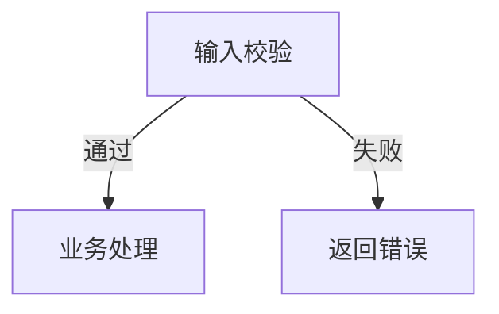

# TUI Diagram（终端字符画图）

在纯文本终端环境里用字符画出结构化图形。图直接显示在对话里，等宽字体下对齐美观、一眼看懂。

**与 visualise 技能的分工**：visualise 输出 SVG/HTML 给 GUI 宿主渲染；本技能输出纯字符，适用于任何 TUI 宿主，不依赖任何渲染器。

## 触发规则

- **只在本技能被显式调用（/tui-diagram）时画图**。不要在普通对话里主动画图。
- 调用时可带主题参数（如 `/tui-diagram 认证流程`），也可不带——不带时回顾当前对话上下文，找出最适合画图的内容。
- 一次调用画一张图。用户想要别的图会再说。

## 核心工作流

被调用后按三步走：

1. **选图型**：分析语境，从下方 9 类路由表中选出最合适的一类（依据见各图型"何时用"）
2. **画图**：按排版规则用字符画出来，直接输出在回复里
3. **提示保存**：图末尾追加一行提示（见"保存机制"）

## 图型路由表

按对话内容的"动词"路由，而不是名词：

| # | 图型 | 用户在问什么 | 典型信号 |
|---|------|-------------|---------|
| 1 | 流程图 | "怎么做""走一遍步骤" | 步骤、顺序、条件分支 |
| 2 | 架构/结构图 | "由什么组成""怎么连的" | 模块、服务、组件、依赖、部署拓扑 |
| 3 | 时序图 | "谁先谁后调用谁" | 多方消息传递、API 调用链、请求生命周期 |
| 4 | 状态机 | "有哪些状态""什么时候变" | 状态流转、生命周期、审批流 |
| 5 | 层级树 | "结构是什么""分类" | 目录结构、组织架构、思维导图、分类体系 |
| 6 | 对比矩阵 | "X 和 Y 哪个好""区别" | 方案选型、功能对比 |
| 7 | 数据条 | "数据怎么样""比例" | 简单数值比较、进度、占比 |
| 8 | UI 线框 | "界面长什么样""布局" | 页面布局、面板划分、CLI 界面 mockup |
| 9 | 时间线 | "排期""什么时候做" | 里程碑、发布计划、带时间维度的步骤 |

**选型犹豫时**的裁决规则：

- 有明确先后 + 条件分支 → 流程图；只有先后没有分支 → 时间线或流程图均可，步骤 ≤5 选时间线
- 多个参与者互相发消息 → 时序图；单一主体内部流转 → 流程图
- 讨论代码模块关系 → 架构图；讨论数据实体关系 → 结构图（盒子 + 关系标注）
- 数据 ≤7 项且只需比大小 → 数据条；需要看多维度差异 → 对比矩阵
- 实在拿不准 → 问用户一句"你想要流程视角还是结构视角？"

## 排版规则（硬性）

字符图的全部质量在于对齐。以下规则不可违反：

### 1. 只用这些字符

```
盒线：┌ ┐ └ ┘ ─ │ ├ ┤ ┬ ┴ ┼
箭头：→ ← ↓ ▲ ▼ ⇒ ⇐ ⇑ ⇓
节点：● ○ ◆ □ ■ ★
其他：… ┄ ┈ ⇢
```

禁止使用 emoji、全角符号做框线、制表符（tab）、ASCII 混用（`+--+`）。

### 2. 宽度对齐——中文是 2 倍宽

中文字符/全角标点占 2 列，英文/半角占 1 列。每个盒子的内宽必须按"显示宽度"算，不是字符数：

```
┌──────────┐
│ 登录验证 │   ← "登录验证"= 8 列宽，两侧各空 1 列，盒子内宽 10
└──────────┘
┌──────────┐
│  OAuth2  │   ← "OAuth2"= 6 列宽，两侧各空 2 列，补齐到 10
└──────────┘
```

画完后自查一遍：**同一列位置上的 `│` 必须纵向对齐**。

### 3. 盒子标准形

```
┌─────────────┐
│  标题文字   │
├─────────────┤   ← 需要副标题/说明时用分隔线
│  补充说明   │
└─────────────┘
```

- 单行盒子高度 3 行；带说明 5 行；说明超过 2 行改用图旁注释
- 盒子标题 ≤12 个汉字宽；更长的内容放图下方的注释列表里

### 4. 连线与箭头

```
横向：┌──────┐         │
      │  A   ├────────▶│  ← 从盒边出发，箭头指向目标盒边
      └──────┘         │

纵向：┌──────┐
      │  A   │
      └──┬───┘
         │
         ▼
      ┌──────┐
      │  B   │
      └──────┘
```

- 箭头一律 `▶`（横向）/ `▼`（向下）/ `▲`（向上），不用 `->` `v` `^`
- 分支标注写在箭头旁：`── 是 ──▶`、`── 否 ──▶`
- 折线拐点用 `┬ ├ ┤ ┴`，避免交叉；必须交叉时用 `┼`

### 5. 整图规格

- 总宽度 ≤80 列（终端安全宽度），超了就拆成上下两段或改布局
- 整图外不留空行包裹；图与前后文字之间各空一行
- 图下方需要注释时用 `> 注：` 列表，编号对应盒子上标 ①②③

### 6. 自检清单

输出前逐项检查：

- [ ] 所有 `│` 纵向对齐了吗？
- [ ] 中英文混排处宽度算对了吗？
- [ ] 总宽 ≤80 列吗？
- [ ] 箭头方向和逻辑方向一致吗？
- [ ] 没有混入 ASCII 线（`-` `|` `+`）吗？

## 9 类图型的字符范式

每类给一个最小示例。画图时参考对应范式，不要发明新格式。

### 1. 流程图

```
        ┌──────────┐
        │  开始    │
        └────┬─────┘
             ▼
      ┌────────────┐
      │ 输入校验   │
      └────┬───────┘
       ┌───┴───┐
   通过│       │失败
       ▼       ▼
┌──────────┐ ┌──────────┐
│ 业务处理 │ │ 返回错误 │
└────┬─────┘ └────┬─────┘
     │            │
     ▼            ▼
   ┌────────────────┐
   │     结束       │
   └────────────────┘
```

### 2. 架构/结构图

```
┌─────────────────────────────────────┐
│              客户端                 │
└──────────────────┬──────────────────┘
                   ▼
        ┌─────────────────────┐
        │      API 网关       │
        └──┬───────────────┬──┘
           ▼               ▼
   ┌──────────────┐  ┌──────────────┐
   │  用户服务    │  │  订单服务    │
   └──────┬───────┘  └──────┬───────┘
          │                 │
          ▼                 ▼
   ┌──────────────┐  ┌──────────────┐
   │   用户库     │  │   订单库     │
   └──────────────┘  └──────────────┘
```

### 3. 时序图

```
客户端          网关           服务          数据库
  │              │              │              │
  ├──请求──────▶│              │              │
  │              ├──鉴权──────▶│              │
  │              │              ├──查询──────▶│
  │              │              │◀──结果──────┤
  │              │◀──响应──────┤              │
  │◀──返回──────┤              │              │
  │              │              │              │
```

### 4. 状态机

```
          ┌─────────────────────┐
          │                     │
          ▼                     │
    ┌────────┐  支付成功  ┌────────┐
    │ 待支付 │──────────▶│ 已支付 │
    └───┬────┘           └───┬────┘
        │ 超时               │ 发货
        ▼                    ▼
    ┌────────┐           ┌────────┐
    │ 已取消 │           │ 已发货 │
    └────────┘           └────────┘
```

### 5. 层级树

```
project/
├── src/
│   ├── api/
│   │   ├── routes.ts
│   │   └── handlers.ts
│   ├── models/
│   └── utils/
├── tests/
└── package.json
```

非目录类层级（如分类体系）用同样风格：

```
错误类型
├── 可重试
│   ├── 网络超时
│   └── 限流 429
└── 不可重试
    ├── 参数错误
    └── 权限不足
```

### 6. 对比矩阵

```
┌──────────┬──────────┬──────────┐
│  维度    │  方案 A  │  方案 B  │
├──────────┼──────────┼──────────┤
│ 性能     │  ★★★   │  ★★     │
│ 成本     │  高      │  低      │
│ 维护性   │  中      │  高      │
└──────────┴──────────┴──────────┘
```

### 7. 数据条

```
Python   ████████████████████ 95
Go       ████████████████     78
Rust     ██████████████       70
Java     ███████████          55
```

条宽按数值线性缩放，最长条不超过 30 格；数值右对齐。

### 8. UI 线框

```
┌─────────────────────────────────┐
│  Logo        搜索框      [头像]│
├─────────┬───────────────────────┤
│         │                       │
│  侧栏   │     内容区域          │
│         │                       │
│  ▸ 菜单1│  ┌─────┐ ┌─────┐     │
│  ▸ 菜单2│  │卡片1│ │卡片2│     │
│  ▸ 菜单3│  └─────┘ └─────┘     │
│         │                       │
├─────────┴───────────────────────┤
│  © 2026 footer                  │
└─────────────────────────────────┘
```

### 9. 时间线

```
9月1日    9月5日       9月12日      9月20日
  │         │            │            │
  ●─────────●────────────●────────────●
  │         │            │            │
  需求冻结  Alpha       Beta        正式发布
```

## 保存机制

**只在用户明说"存下来""记下来""保存这个图"时才落盘**。平时画完即弃，不主动写文件。

用户要求保存时：

1. **转换载体**：把当前图（可多张）转换成 Mermaid 或保留原样——
   - 能转的转 Mermaid：流程图→`flowchart TD`、时序图→`sequenceDiagram`、状态机→`stateDiagram-v2`、层级树→`graph TD` 或保留 text、结构图→`flowchart LR`、时间线→`gantt`、对比矩阵→保留 text
   - **转不了的保留原样**，用 `text` 代码块：UI 线框、数据条、以及任何转换后会失真的图
2. **追加写入**：目标文件是**工作目录根部的 `diagrams.md`**（固定文件名，不询问）。文件不存在则创建并加一级标题；存在则追加，不覆盖已有内容
3. **条目格式**：每张图一个二级标题 + 代码块 + 来源日期：

```markdown
## 认证流程

来自会话：2026-09-13


```

```markdown
## 首页布局线框

来自会话：2026-09-13

```text
┌─────────────────────────────────┐
│  Logo        搜索框      [头像]│
├─────────┬───────────────────────┤
...
└─────────────────────────────────┘
```
```

4. **回复格式**：保存后简短告知——"已存入 diagrams.md（第 N 张）"，附上图型名和标题，不贴全文。

Mermaid 转换对照速查：

| 字符图型 | Mermaid 语法 | 备注 |
|---------|-------------|------|
| 流程图 | `flowchart TD` | 条件分支用 `-->|标注|` |
| 架构图 | `flowchart LR` | 分层结构用 subgraph |
| 时序图 | `sequenceDiagram` | participant + arrow |
| 状态机 | `stateDiagram-v2` | `[*]` 表示起止 |
| 层级树 | `graph TD` | 或直接保留 text 块 |
| 对比矩阵 | 保留 text | Mermaid 无表格语义 |
| 数据条 | 保留 text | 或转 `pie`/`gantt`，但常失真 |
| UI 线框 | 保留 text | 忠实优先 |
| 时间线 | `gantt` 或 `timeline` | 看内容选 |

## 输出位置约定

- 图直接画在回复正文里，不需要任何代码围栏包裹（终端原生渲染）
- 唯一例外：用户要求保存且选择保留 text 块时，落盘内容放 `text` 围栏里
- 画完的图末尾固定加一行小字提示：

```
（如需保存这张图，说"存下来"即可）
```
